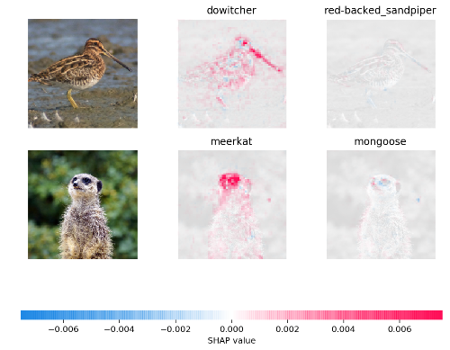

# Model Interpretation

As models become more and more complex, it's becoming increasingly important to develop methods for interpreting the decisions of the model. In this repository I try to provide a overview of some libraries you can use to interpret models.

If you want more information about the topic you can check out my articles about the topic:
* [Introduction to Machine Learning Model Interpretation](https://gilberttanner.com/blog/introduction-to-machine-learning-model-interpretation)
* [Hands-on Global Model Interpretation](https://gilberttanner.com/blog/hands-on-global-model-interpretation)
* [Local Model Interpretation: An Introduction](https://gilberttanner.com/blog/local-model-interpretation-an-introduction)
* [Interpreting Tensorflow models with tf-explain](https://gilberttanner.com/blog/interpreting-tensorflow-model-with-tf-explain)
* [Interpreting PyTorch models with Captum](https://gilberttanner.com/blog/interpreting-pytorch-models-with-captum)

## Captum

Captum is a flexible  easy-to-use model interpretability library for PyTorch, providing state-of-the-art tools for understanding how specific neurons and layers affect predictions.

You can find a few examples on how to use Captum in the [Captum directory](Captum/).

## tf-explain

tf-explain implements interpretability methods for Tensorflow models. It supports two APIs: the Core API which allows you to interpret a model after it was trained and a Callback API which lets you use callbacks to monitor the model whilst training.

You can find a few examples on how to use Captum in the [tf-explain directory](TFExplain/).

## Shap

SHAP (SHapley Additive exPlanations) is a game theoretic approach to explain the output of any machine learning model. It connects optimal credit allocation with local explanations using the classic Shapley values from game theory and their related extensions (see papers for details and citations).

You can find a few examples on how to use Captum in the [SHAP directory](Shap/).

## LIME

Lime, Local Interpretable Model-Agnostic, is a local model interpretation technique using Local surrogate models to approximate the predictions of the underlying black-box model.

You can find a few examples on how to use Captum in the [Lime directory](Lime/).

## Credit

Credit goes to the people how wrote the libraries covert in the repository. I'm merely showing you some examples so you can get a idea how the libraries work.